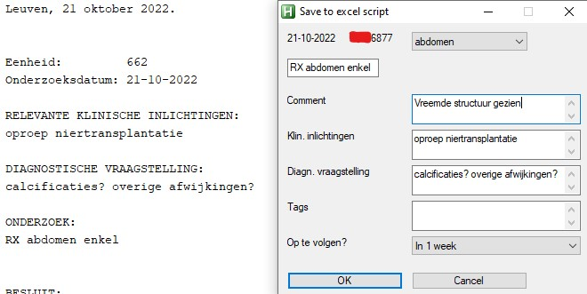
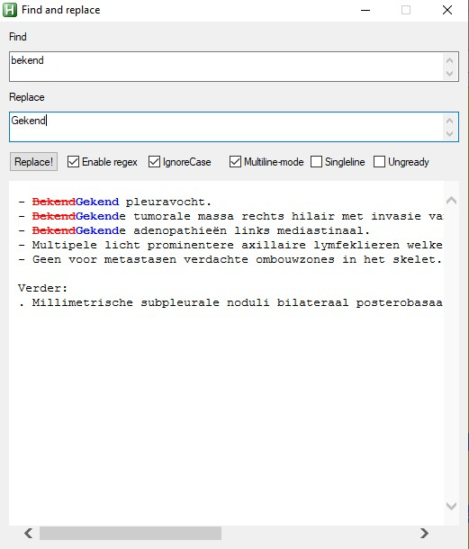

# KWS-helper
Collectie van Autohotkey scripts om de radiologie workflow te verbeteren.

Werkt met de nieuwe versie van KWS (van 20-06-2022).

## Installatie
1. Download de bestanden van deze repo [hier](https://github.com/CVanmarcke/KWS-helper/archive/refs/heads/main.zip), en pak deze uit ergens in een folder. 
2. Start het programma via `AutohotkeyU64.exe`

### Automatisch opstarten
Om het script automatisch te laten opstarten met de computer, volg deze stappen:
1. `Rechtsklik` op AutohotkeyU64.exe --> `Kopiëren`.
2. Typ `Windows knop + R` (open het `run` venster). Typ hierin `shell:startup`.
3. Er zal een windows verkennen scherm openen. In dit verkenner scherm `rechtsklik` --> `snelkoppeling plakken`.

<!---
[//]: # 1. Download eerst de zip versie van [Autohotkey hier](https://www.autohotkey.com/download/ahk.zip). Rechts klik -> uitpakken, en kies een locatie die je terugvindt (bijvoorbeeld documenten of bureaublad).

1. Download vervolgens de bestanden van deze repo [hier](https://github.com/CVanmarcke/KWS-helper/archive/refs/heads/main.zip), en pak deze uit ergens in een folder. 

[//]: # 2. Kopiëer dan de inhoud (dus de `.ahk` bestandjes + de `images` folder) in de eerste folder, die `AutohotkeyU64.exe` bevat. Hieronder is een voorbeeld van hoe de inhoud van de folder er uit zou moeten zien.
2. Start het programma via `AutohotkeyU64.exe`

[//]: # 
-->

## Hotkeys veranderden
De hotkeys zijn gedefinieerd in `AutohotkeyU64.ahk`. Zie de [Autohotkey tutorial](https://www.autohotkey.com/docs/Tutorial.htm#s2) voor een korte handleiding hoe deze te veranderen.

`Shift Lock` is veranderd naar start/stop opnemen van de speechkit (F8): dit is een veel ergonomischere knop voor de linkerhand, die dan gewoon op de middelste rij van het toetsenbord kan liggen. Om `Shift Lock`aan of uit te zetten kan je de `rechter ctrl` knop gebruiken. 

## Mogelijke functies
Functienaam | Standaard Hotkey | Beschrijving 
--- | --- | --- 
copyLastReport_KWS() | `Alt-r`, `F7` `-i- (speechkit)` | Plakt de inhoud van het voorgaande verslag in het huidige, corrigeert de inhoud en data, voegt "in vergelijking met" toe, en doet enkele kleinere aanpassingen. 
onveranderdMetVorigVerslag() | `F7` `-i- (speechkit)` | Zoekt de datum van het laatste gelijkaardige verslag, en zet die in de zin "Vergeleken met het vorige onderzoek van XXXXX: Globaal ongewijzigde positie van het supportmateriaal. Globaal ongewijzigde cardiopulmonaal beeld"
cleanReport_KWS() | `Alt-c`,`F9` `F3 (speechkit)` | Kuist het huidige verslag op door meerdere kleine aanpassingen te doen: oa. zet een punt achter elke zin, corrigeert de hoofdletter die achter een dubbelpunt wordt gezet, zet streepjes voor elke lijn, sorteert alles met een punt vooraan onder het verslag (en respecteert subheadings bij bijv thorax-abdomen of conclusies), flair->FLAIR, bekend->gekend, besluit->conclusie, D11-D12 -> Th11-Th12, ... Deze instellingen kunnen worden aangepast onder de functie `cleanreport(inputtext)`
validateAndClosePt_KWS() | `INS (speechkit, 2x duwen)` | Valideert het verslag door tweemaal op de knop te duwen. Voegt bijkomend dit toe aan de logfile: de patiënt kan opnieuw geopend worden door eender waar `openlastpt` te typen. 
saveAndClosePt_KWS() | `EOL (speechkit, 2x duwen)` | Slaat het verslag op en sluit het vervolgens, door tweemaal op de knop te duwen. Voegt bijkomend dit toe aan de logfile: de patiënt kan opnieuw geopend worden door ergens `openlastpt` te typen.  
heightLossGUI() | `hoogteverlies` `wervelfx` | Typ de shortcut om een klein venster te krijgen waar je de hoogte van 2 wervels kan typen, waarna automatisch het hoogteverlies (in mm en %) geplakt zal worden. 
findAndReplaceGUI() | `Ctrl-r` | Selecteer de tekst om een "find and replace" functie te openen (met REGEX functionaliteit).
openLastPtInLog_KWS() | `openlastpt` | Typ de shortcut eender waar om de laatste patiënt gesloten via `validateAndClosePt_KWS` of `saveAndClosePt_KWS` opnieuw te openen. 
pedAbdomenTemplate() | `pedabdomen` | Typ de shortcut om een venster te openen waar de lengte van de lever, milt en nieren in ingevuld kunnen worden, waarna automatisch een verslag met ingevulde standaarddeviaties geplakt zal worden. Origineel gemaakt door Johannes Devos.
MoveLineUp() | `Alt-&` of `Ctrl-↑` `rewind (speechkit)` | Verplaatst de huidige lijn één lijn naar boven (wisselt de huidige lijn met de lijn er net boven).
MoveLineDown() | `Alt-é`, `Ctrl-↓` `forward (speechkit)` | Verplaatst de huidige lijn één lijn naar onder (wisselt de huidige lijn met de lijn er net onder).
deleteLine() | `Alt-d` of `Ctrl-d` | Verwijdert de huidige lijn. 
auto_scroll() | `Ctrl-&` of `Ctrl-é` | Start automatisch met scrollen in het venster waar de muis in staat (Enterprise of IMPAX). Vertragen met `&` en versnellen met `é`, omkeren van richting met `space`. Gemaakt door Johannes Devos.
KWStoExcel(padNaarExcelBestand) | `Ctrl-e` | Voegt de patientEAD, datum, onderzoekstype, ... automatisch toe aan een excel bestand. Handig om snel een casus bij te houden om op te volgen.
openEAD_KWS() | `Ctrl-o` | In excel (of in Google Spreadsheet), open automatisch het geselecteerde EAD nummer in KWS.

## Speechkit knoppen
Knop | functie
--- | --- 
`EOL (2x duwen)` | saveAndClosePt_KWS() 
`-i-` | copyLastReport_KWS() 
`INS (2x duwen)` | validateAndClosePt_KWS() 
`record` | Niet aangepast: start/stop opnemen. 
`rewind` | MoveLineUp() 
`forward` | MoveLineDown() 
`play/pause` | `Backspace` 
`F1` | copyLastReport_KWS() 
`F2` | Sluit het huidige verslag zonder op te slaan.
`F3` | cleanReport_KWS() 
`F4` | Ctrl-F8 (start speechkit in venster)
`back button (hold)` | Simuleert de Ctrl knop: kan gebruikt worden om in enterprise te zoomen en pannen. 

## Headset workflow verbeteringen
Er zijn meerdere aanpassingen voor diegene die met de linkerhand vrij werken, zodat meerdere acties gedaan kunnen worden zonder met de rechterhand de muis los te moeten laten.

De belangrijkste verandering is dat de speech gestart en gestopt kan worden met capslock: hierdoor kan de linkerhand in een neutrale positie op het toetsenbord blijven staan.

Knop | functie
--- | --- 
`Capslock` | Start/stop speech (F8)
`Ctrl-Capslock` | Capslock
`Alt-v` | validateAndClose_KWS()
`Alt-s` | saveAndClose_KWS()
`Ctrl-s` | saveAndClose_KWS() 
`Alt-c` | cleanReport_KWS()
`Alt-r` | copyLastReport_KWS()
`Alt-g` | onveranderdMetVorigVerslag()
`Alt-d` | deleteLine()
`Alt-x` | Backspace
`Alt-&` | MoveLineUp()
`Alt-é` | MoveLineDown()

## Voorbeelden

### Report opkuisen
De functie `cleanReport_KWS()` (gebonden aan de knop `Alt-c`,`F9` of `F3 (Philips microfoon)`) maakt automatisch het verslag ordelijk, corrigeert frequente fouten, en zet de puntjes op de i.

Enkele functies zijn oa:

- zet een kleine letter achter een dubbelpunt ipv een hoofdletter (speech fout).
- een punt op het einde van elke zin.
- een hoofdletter achter elk punt.
- fixt dat sommige streepjes vervangen worden door een vraagteken.
- maakt de layout ordelijk:
  - een - voor elke zin.
  - zinnen die beginen met een punt worden onderaan in het verslag gezet (nevenbevinding). Hetzelfde met zinnen die eindigen met een hekje (`#`)
  - zinnen die eindigen met en slash (`/`) worden geindenteerd (`  . `).
  - elke zin met `*` vooran wordt in hoofdletters gezet.
- corrigeert enkele woorden:
  - "pig katheter" -> PIC katheter
  - flair, tbc, ecg -> FLAIR, TBC, ECG
  - hili -> hila
  - bekend -> gekend
  - segment I tot VIII -> segment 1 tot 8
  - fascikels graag -> Fazekas graad

### KWS to excel

Standaard shortcut is `Ctrl-e`

Het EAD, de datum, subdiscipline, klinische inlichtingen, en diagnostische vraagstelling worden automatisch ingevuld.

De locatie van het excel bestand kan veranderd worden in het bestand `AutohotkeyU64.ahk`.

Kan vervolgens in Excel gecombineerd worden met `OpenEADKWS()`(standaard shortcut is `Ctrl-o`) om snel de patient opnieuw te openen

### TIRADS calculator
Typ `tiradsnodule` in het verslag. Een popup zal verschijnen waarin je de TIRADS score kan berekenen, met automatisch een gestructureerde tekst om in het verslag te plakken.

TODO: voorbeeldje

### Pediatrie Abdomen
Typ `pedabdomen` in het verslag.

Het script zal automatisch de standaarddeviaties berekenen op basis van de leeftijd, en het verslag in KWS plakken.

### Find and replace

### Height Loss Gui

## Ideeën, bigfixes en aanpassingen
Liefst een berichtje op Whatsapp of UZ Leuven mail.

Voor bugfixes graag de error noteren en op welke lijn de error voorkwam, samen met een beschrijving van hoe het wordt uitgelokt.
